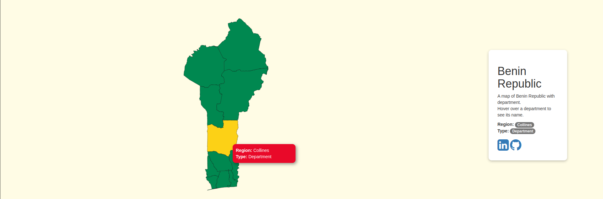

# Benin Republic

A simple map of Benin republic using `D3js`

# Summary

It's quiet simple.

- Download shapefile on  [http://www.gadm.org]( http://www.gadm.org.).
- Convert Shapefile to TopoJson. [http://mapshaper.org](http://mapshaper.org)

# Quick start

Clone the repo

    git clone https://github.com/Gio229/benin-map-d3js.git

Then start the project with an `HTTP server`

# Inspired from

> [d3-js-map-hong-kong](https://github.com/ywng/d3-js-map-hong-kong)
